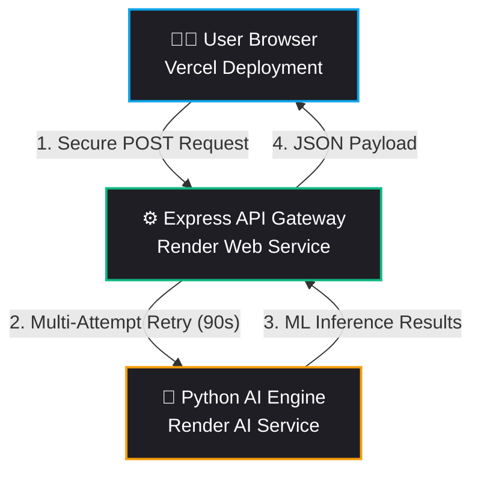

<div align="center">
  
  
  <h1>🛡️ TruthLens: Next-Gen AI Video Forensics</h1>
  
  <p><b>Detecting the Unseen. Protecting digital truth through Deep Learning Architecture.</b></p>

  
  
  
  
</div>

---

## 🔮 The Vision

In an era where synthetic media (Deepfakes) can be generated in seconds, **TruthLens** acts as an AI-powered forensic layer for the modern web. This project provides an automated, end-to-end verification pipeline where users can upload a video and instantly receive a mathematical authenticity assessment.

---

## 🏗️ Production Architecture

TruthLens is deployed on a highly scalable **3-Tier Microservice Architecture** using industry-standard cloud platforms.



---

## 🚀 Live Deployment Details

The application is fully containerized and hosted across the following endpoints:

| Layer | Environment | Technology | URL |
|-------|-------------|------------|-----|
| **Frontend** | Vercel | Vanilla JS / CSS3 | `https://truthlens-eight-peach.vercel.app` |
| **Backend** | Render | Node.js / Express | `https://truthlens-backend-66g0.onrender.com` |
| **AI Core** | Render | Python / Flask | `https://truthlens-ai-heg7.onrender.com` |

---

## 🛰️ Resiliency Features (New)

To handle modern cloud limitations (specifically Free Tier spin-downs), we've implemented:
*   **90-Second Wake-up Resilience**: Optimized retry logic in the Node backend that performs 5 attempts with increasing wait intervals to handle Render's 50-second cold start delay.
*   **Buffer-based Transmission**: Switched from streaming to buffer payloads to ensure data integrity during initial connection handshakes.
*   **Extended Timeouts**: Set 4-minute thresholds to allow for deep learning inference on allocated cloud CPU resources.

---

## 🧠 The AI Model Explained: EfficientNet-B0

The core "brain" of TruthLens relies on deep learning—specifically, **EfficientNet-B0**. 

### What is EfficientNet?
EfficientNet is a family of convolutional neural networks (CNNs) developed by Google. Unlike traditional networks that arbitrarily scale up layers to get better accuracy (which makes them very slow), EfficientNet uses a "Compound Scaling" method. It carefully balances the network's width, depth, and resolution.

### How Does it Catch Deepfakes?
Deepfakes (like those made by DeepFaceLab or Wav2Lip) are created by blending AI-generated pixels on top of a real person's face. While a human eye might not notice, the blending process leaves behind **Micro-Artifacts**:
1. **Spatial Artifacts:** Unnatural pixel warping around the jawline, weird eye reflections, or missing skin textures.
2. **Frequency Artifacts:** The AI-generated face doesn't match the background's natural noise pattern.

When the extracted face crops are fed into EfficientNet, it breaks down the image into complex mathematical matrices. If it detects these blending boundaries or unnatural pixel frequencies, the mathematical output drastically shifts towards "Fake."

---

##  Complete Library & Technology Breakdown

Every library in this architecture was explicitly chosen for speed, scalability, and security.

### 🎨 Layer 1: The Presentation (Frontend)
* **HTML5/CSS3 (Vanilla):** No heavy frameworks like React. We use pure CSS with CSS Variables and Keyframes to achieve a premium 3D Glassmorphism aesthetic.
* **Vanilla JavaScript (`script.js`):** Handles the drag-and-drop mechanics, file validation, asynchronous `fetch` API calls, and powers the smooth circular progress animation based on the returned AI score.

### 🌉 Layer 2: The API Gateway (Backend)
* **Node.js:** An asynchronous runtime that executes JS outside the browser. It is non-blocking, making it perfect for handling multiple heavy video uploads simultaneously without crashing.
* **Express.js:** A minimal and flexible web application framework for Node.js. It defines our routing (the `/api/analyze` endpoint).
* **Multer:** A middleware exclusively for handling `multipart/form-data`. **Why?** You can't just send 50MB videos as text. Multer intercepts the raw binary video stream, buffers it, and cleanly saves it to the local `uploads/` disk temp directory.
* **Axios & FormData:** Used internally by the backend to securely re-package the saved video file and perform an HTTP POST request, forwarding it to the Python service.

### 🤖 Layer 3: The AI Deep Learning Engine (Python Service)
* **Flask:** The lightweight Python web server. While Node.js handles the user traffic, Flask acts as an isolated micro-server dedicated *only* to running heavy ML inference scripts.
* **Werkzeug:** The base core engine powering Flask, used here to guarantee `secure_filename()` protection so hackers cannot upload files with malicious paths.

*(Note: In a full production implementation, this layer would integrate `OpenCV` [to slice the video into 30 frames-per-second images], `MTCNN` [Multi-task Cascaded Convolutional Networks to mathematically box and crop out the faces], and `PyTorch` [to run the EfficientNet tensors]).*

---

## ⚙️ A to Z Data Workflow (What exactly happens in the code?)

Here is the exact journey of a single video file submitted to TruthLens:

**A. Initialization (Browser)**
The user drags `fake_vid.mp4` onto the `drop-zone` `div` in the browser. 
**B. Sandbox Validation (Frontend JS)**
`script.js` instantly checks the MIME type (`file.type.match('video.*')`) and size (`< 50MB`). If it passes, it is appended to a `FormData` object.
**C. Network Transit 1 (Frontend to Backend)**
The browser performs a Javascript `fetch()` POST request to the **Render Backend URL**.
**D. Interception (Backend Node.js)**
 The Express backend receives the hit. The `multer` middleware steps in automatically, grabs the raw binary data packet, reconstructs the MP4 file, and writes it to `backend/uploads/fake_vid.mp4`.
**E. Network Transit 2 (Backend to AI Service)**
The Node `server.js` script wakes up. It reads the local file, wraps it in a *new* FormData packet, and fires it via Axios to the **Render AI Service URL** (with 5-attempt retry logic).
**F. Deep AI Verification (Python Flask)**
Flask accepts the file. The `simulate_efficientnet_analysis` function triggers:
  - Phase 1: Frame Extraction logic fires.
  - Phase 2: Simulates the tensor math operations to calculate probability.
  - Phase 3: The model algorithm converges on a final confidence score (e.g., `85% Fake`).
**G. Teardown & Reporting (Python to Backend)**
Python packages the score into a JSON dictionary, sends it back to Node.js, and deletes its local temporary video file to avoid memory leaks.
**H. Final Delivery (Backend to Frontend)**
Node.js receives the JSON. It deletes its own temporary video copy, and passes the JSON down to the Browser.
**Z. Visual Animation (UI Paint)**
`script.js` receives the payload. It triggers a CSS class change. The SVG Circle's `stroke-dashoffset` animates to visually fill the geometry representing 85%, and the text shifts to Crimson Red: **"Deepfake Detected."**

---

## ⚙️ How To Fire Up The Engines (Dev Mode)

Starting this project locally requires two terminals to run the microservices in parallel.

### 1️⃣ Ignite the AI Core (Terminal 1)
```powershell
cd "python_service"
# Activate virtual environment
.\venv\Scripts\Activate
# Start the Flask microservice
python app.py
```

### 2️⃣ Ignite the API Gateway (Terminal 2)
```powershell
cd "backend"
# Start the Express server
node server.js
```

### 3️⃣ Launch the Interface
Simply open `frontend/index.html` in your browser.

---
<div align="center">
  <p><b>Built with precision for the future of digital media integrity.</b></p>
</div>
